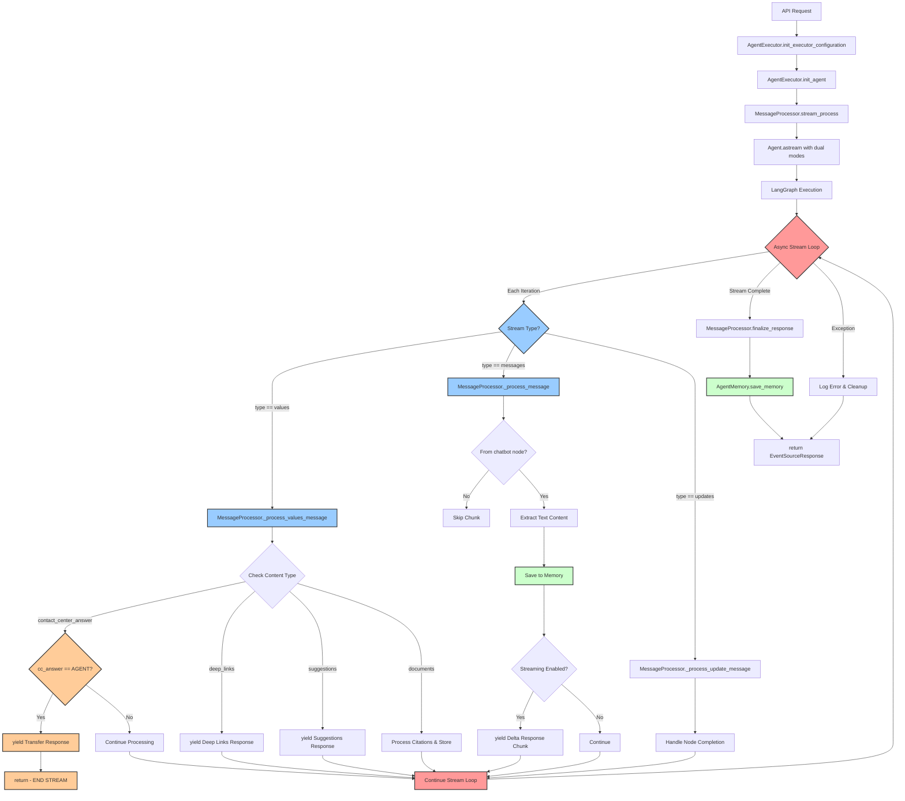

[← Back to Documentation Home](README.md)

# Agent Execution Flow Analysis

## Overview

The agent execution system has evolved from a monolithic `_execute` method to a modular architecture with specialized components. The flow now involves `AgentExecutor` orchestration, `MessageProcessor` stream handling, and `Agent` graph execution. This document provides a detailed breakdown of the current flow with code references and visual diagrams.

## Current Architecture Flow



### **Key Architecture Changes**

**🏗️ Modular Components**: Separated orchestration (`AgentExecutor`), processing (`MessageProcessor`), and memory (`AgentMemory`)

**⚡ Enhanced Streaming**: Three stream types (`messages`, `values`, `updates`) with specialized handlers

**🧠 Memory Integration**: Dual memory system with AgentCore and DynamoDB backends

**� Improved Error Handling**: Component-level error recovery and graceful degradation

**� Citation Processing**: Integrated document processing with presigned URL generation

**🚨 Safety Integration**: Multi-layer guardrail system with real-time content filtering

## Code Reference Map - Current Architecture

### **Phase 1: AgentExecutor Initialization** - *[AgentExecutor.__init__](../src/ia_mb_api_chatbot/services/agent_execution/agent_executor.py#L25-L30)*

```python
# agent_executor.py:25-30
class AgentExecutor:
    def __init__(self):
        self.settings = ia_mb_api_chatbot.configuration.settings.get_settings()
        self.service_aws = AWS()
```

**Purpose**: Initialize core services and configuration settings

---

### **Phase 2: Configuration Setup** - *[init_executor_configuration](../src/ia_mb_api_chatbot/services/agent_execution/agent_executor.py#L32-L55)*

```python
# agent_executor.py:32-55
def init_executor_configuration(
    self,
    conversation_id: str,
    client_id: Optional[str],
    interaction_id: Optional[str],
    session_id: str,
    options: Options,
    turn_count: int,
):
    self.session_context = SessionContext(
        conversation_id=conversation_id,
        client_id=client_id,
        interaction_id=interaction_id,
        session_id=session_id,
        turn_count=turn_count,
        # ... additional session parameters
    )
```

**Purpose**: Set up session context and execution parameters

---

### **Phase 3: Agent and Component Initialization** - *[init_agent](../src/ia_mb_api_chatbot/services/agent_execution/agent_executor.py#L65-L95)*

```python
# agent_executor.py:65-95
async def init_agent(self):
    # Initialize guardrails
    if self.settings.guardrails.use_alinia_guardrails:
        self.agent_guardrails = AgentGuardrailsAlinia()
    else:
        self.agent_guardrails = AgentGuardrailsBedrock(self.service_aws)
    
    # Initialize memory system
    if self.settings.chat.use_agentcore_memory:
        self.agent_memory = AgentMemoryAgentCore(...)
    else:
        self.agent_memory = AgentMemoryDynamoDB(...)
    
    # Create agent and message processor
    tracer_provider = TracerProvider()
    self.agent = Agent(self.suggestions, tracer_provider, self.agent_guardrails)
    await self.agent.init_llm_models()
    
    self.message_processor = MessageProcessor(...)
```

**Purpose**: Initialize all execution components with proper configuration

---

### **Phase 4: Stream Processing** - *[MessageProcessor.stream_process](../src/ia_mb_api_chatbot/services/agent_execution/message_processor.py#L160-L175)*

```python
# message_processor.py:160-175
async for message_type, value in self.agent.astream(
    {
        "messages": [SystemMessage(prompt)] + previous_conversation + [HumanMessage(user_question)],
        "user_question": user_question,
    },
    stream_mode=self.stream_mode,
):
    if message_type == "updates":
        await self._process_update_message(value)
    elif message_type == "values" and isinstance(value, dict):
        async for message in self._process_values_message(value):
            yield message
    elif isinstance(value, tuple):
        async for message in self._process_message(value):
            yield message
```

**Purpose**: Orchestrate dual stream processing with specialized handlers

---

### **Phase 5: Values Stream Processing** - *[_process_values_message](../src/ia_mb_api_chatbot/services/agent_execution/message_processor.py#L195-L250)*

```python
# message_processor.py:195-250
async def _process_values_message(self, value: dict) -> AsyncGenerator[str]:
    # Handle contact center detection
    if "contact_center_answer" in value:
        cc_answer = value["contact_center_answer"]
        if cc_answer and cc_answer.answer == "AGENT":
            # Immediate transfer - end stream
            yield json.dumps(SendMessageToAgentResponse.build_transfer_response(...))
            self.finished = True
            return
    
    # Handle deep links
    if "deep_links" in value and value["deep_links"]:
        yield json.dumps(SendMessageToAgentResponse.build_deep_links_response(...))
    
    # Handle suggestions
    if "suggestions" in value and value["suggestions"]:
        yield json.dumps(SendMessageToAgentResponse.build_suggestions_response(...))
    
    # Handle documents for citations
    if "documents" in value:
        async for message in self._process_documents(value["documents"]):
            yield message
```

**Purpose**: Process complete node outputs for business logic decisions and metadata

**Purpose**: Set up streaming response generator and load conversation context

---

### **Phase 4: Conversation History Processing** - *[Lines 389-406](../chatbot_api/services/conversation.py#L389-L406)*

```python
# conversation.py:389-406 - https://github.com/santander-group-ods/IA-mb-api-chatbot/blob/main/chatbot_api/services/conversation.py#L389-L406
previsous_conversation = []
for item in previous_conversation_items:
    if item.get("guardrailApplied", {}).get("BOOL", False):
        continue  # Skip guardrail-filtered messages
    if item.get("author", {}).get("S", "") in ["human", "retriever"]:
        message = HumanMessage(item.get("message", {}).get("S", ""))
    else:
        message = AIMessage(item.get("message", {}).get("S", ""))
    previsous_conversation.append(message)
```

**Purpose**: Convert DynamoDB conversation history to LangChain message format

---

### **Phase 5: LangGraph Stream Execution** - *[Lines 410-421](../chatbot_api/services/conversation.py#L410-L421)*

```python
# conversation.py:410-421 - https://github.com/santander-group-ods/IA-mb-api-chatbot/blob/main/chatbot_api/services/conversation.py#L410-L421
async for type, value in agent.astream(
    {
        "messages": [SystemMessage(PROMPT)]
        + previsous_conversation
        + [HumanMessage(user_question)],
        "user_question": user_question,
    },
    stream_mode=["messages", "values"],
):
```

**Purpose**: Start LangGraph execution with dual stream modes

#### **Stream Modes Explained**

- **`"messages"`**: Streams individual AI response chunks (for real-time chat)
- **`"values"`**: Streams complete node outputs (for intent classification, tools, etc.)

#### **Understanding Dual Flow Modes**

The `stream_mode=["messages", "values"]` creates **two parallel data streams** that enable sophisticated real-time processing:

**1. "values" Stream** 📦

**What it contains**: Complete outputs from LangGraph workflow nodes

**When it triggers**: When a node finishes processing

**Example data**:
```python
{
    "contact_center_answer": CCAnswer(answer="AGENT"),
    "deep_links": ["https://example.com/help"],
    "suggestions": SuggestionsAnswer(followup_questions=["What else?"]),
    "documents": [Document(...), Document(...)],
    "guardrail_applied": False
}
```

**2. "messages" Stream** 💬

**What it contains**: Real-time AI response chunks as they're generated

**When it triggers**: As the AI generates each piece of text

**Example data**:
```python
[AIMessage(content="Hello"), {"langgraph_node": "chatbot"}]
```

**How They Work Together**

Looking at the code flow:

```python
if type == "values":
    # Process complete node outputs
    if not cc_answer and "contact_center_answer" in value:
        cc_answer = value["contact_center_answer"].answer
        if cc_answer == "AGENT":
            # Transfer to human agent immediately
            yield json.dumps(...)
            return
```

vs.

```python
else:  # type == "messages"
    # Process real-time AI chunks
    metadata = value[1]
    chunk = value[0]
    if metadata.get("langgraph_node", "") != "chatbot":
        continue
    total_message += chunk
    if chunk and is_streaming:
        yield json.dumps(...)  # Stream chunk to user
```

**Why Dual Modes Matter**

**Business Logic Decisions** (values stream):
- **Contact Center Intent**: `cc_answer == "AGENT"` → Transfer to human
- **Deep Links**: Show navigation options  
- **Suggestions**: Display follow-up questions
- **Documents**: Handle RAG citations

**Real-time User Experience** (messages stream):
- **Immediate Feedback**: User sees response as it's generated
- **Streaming Chat**: Like ChatGPT's typing effect
- **Responsive UI**: No waiting for complete response

**The Key Insight**

The system can **simultaneously**:
1. **Make smart decisions** based on AI analysis (values)
2. **Stream responses** in real-time for user experience (messages)

This enables intelligent routing (like transferring to human agents) while maintaining real-time responsiveness.

**Without dual modes**, you'd have to choose: either wait for complete analysis OR stream without intelligent routing. With dual modes, you get both! 🎉

---

### **Phase 6A: Values Stream Processing** - *[Lines 422-482](../chatbot_api/services/conversation.py#L422-L482)*

The values stream is where the system processes **complete outputs from LangGraph nodes**. Each `if` condition handles a different type of node completion, creating a sophisticated routing and enhancement system.

#### **🎯 Understanding Values Stream Architecture**

**Key Insight**: The `if type == "values"` block is essentially a **node output dispatcher** that handles different types of completed work from the LangGraph workflow.

```python
if type == "values":
    # 1️⃣ CONTACT CENTER CLASSIFICATION → Human intervention decision
    if not cc_answer and "contact_center_answer" in value:
        # From: check_cc_redirect node
        # Output: "AGENT" or "OTHER"
        # Action: Transfer to human OR continue with AI
    
    # 2️⃣ DEEP LINKS EXTRACTION → Resource discovery  
    if not deep_links and "deep_links" in value:
        # From: deep_link_invoke node
        # Output: Array of helpful links
        # Action: Send links to user interface
    
    # 3️⃣ SUGGESTIONS GENERATION → Follow-up questions
    if not suggestions_answer and "suggestions" in value:
        # From: suggestions node
        # Output: Array of suggested questions  
        # Action: Display suggested questions in UI
    
    # 4️⃣ FINAL STATE CAPTURE → Complete workflow metadata
    final_state = value
    # From: Any node completion
    # Contains: Documents, guardrail info, metadata
    # Used for: Citations, database storage, error tracking
```

#### **Why This Parallel Architecture Exists**

The system runs **multiple nodes simultaneously** to provide comprehensive assistance:

```python
# From agent.py - LangGraph workflow construction
empty_initial 
    ├── chatbot → tools → chatbot → empty_final    ← Main conversation
    ├── check_cc_redirect → empty_final            ← ALWAYS RUNS (safety net)
    ├── deep_link_invoke → empty_final             ← IF ENABLED (navigation help)  
    └── suggestions → empty_final                  ← IF ENABLED (conversation guidance)
```

**This means every user message triggers:**
- **Contact center analysis** (Is human help needed?)
- **Main AI processing** (Generate the actual response)
- **Optional enhancements** (Links, suggestions, etc.)

**Result**: The system can make intelligent routing decisions while simultaneously preparing the AI response and helpful enhancements.

> **📋 IMPLEMENTATION NOTE:** This parallel processing approach has significant resource implications. For detailed explanation of the resource consumption trade-offs and implementation rationale, see **[Pattern #1: Parallel Processing Architecture](architecture-decisions.md#pattern-1-parallel-processing-architecture-in-langgraph-workflow)** in the Architectural Implementation Patterns document.

#### **Contact Center Classification: The Critical Decision Point**

The contact center logic represents the most important routing mechanism in the entire system.

**What is `cc_answer`?**

`cc_answer` stores the AI's decision about whether the user needs human intervention. It's **NOT** the contact center's response—it's the **routing decision**.

**Step-by-Step Flow:**

**1. Initial State** - *[Line 386](../chatbot_api/services/conversation.py#L386)*
```python
cc_answer = None  # No decision made yet
```

**2. Classification Trigger** - *[Line 423](../chatbot_api/services/conversation.py#L423)*
```python
if not cc_answer and "contact_center_answer" in value:
    cc_answer = value["contact_center_answer"].answer
```

**3. The Critical Decision** - *[Lines 424-434](../chatbot_api/services/conversation.py#L424-L434)*
```python
if cc_answer == "AGENT":
    # User needs human help - end stream immediately
    yield json.dumps(
        SendMessageToAgentResponse.build_transfer_to_agent_response(
            session_context=session_context
        ).model_dump(),
        ensure_ascii=False,
    )
    return  # ← TERMINATES ENTIRE STREAM
else:
    # AI can handle this - continue with conversation
    logger.debug("User intent recognized as OTHER, continuing conversation")
    # Send initial response to start AI conversation
    if is_streaming:
        yield json.dumps(
            SendMessageToAgentResponse.build_send_conversation_response(
                total_message, session_context, state
            ).model_dump(),
            ensure_ascii=False,
        )
```

**Understanding the `return` Statement:**

The `return` is crucial—it **immediately exits the entire `event_generator` function**, stopping all processing. This means:

- **If `"AGENT"`**: User gets transfer message, stream ends
- **If `"OTHER"`**: Stream continues to AI response generation

**Real-World Decision Examples:**

```python
# Example 1: Needs Human
# User: "I want to cancel my account and get a refund immediately!"
# AI Analysis: "Complex account changes need human approval"
# Result: cc_answer = "AGENT" → Transfer to human agent

# Example 2: AI Can Handle  
# User: "What's my current account balance?"
# AI Analysis: "Simple query, I can handle with knowledge base"
# Result: cc_answer = "OTHER" → Continue to AI response
```

#### **Enhancement Processing (Deep Links & Suggestions)**

After the critical routing decision, the system processes additional enhancements:

**Deep Links Processing** - *[Lines 453-465](../chatbot_api/services/conversation.py#L453-L465)*
```python
if not deep_links and "deep_links" in value and value["deep_links"]:
    deep_links = value["deep_links"]
    yield json.dumps(
        SendMessageToAgentResponse.build_deep_links_response(
            session_context=session_context,
            deeplinks=deep_links,
            state=state,
        ).model_dump(),
        ensure_ascii=False,
    )
```

**Suggestions Processing** - *[Lines 466-478](../chatbot_api/services/conversation.py#L466-L478)*
```python
if not suggestions_answer and "suggestions" in value:
    suggestions_answer = value["suggestions"]
    yield json.dumps(
        SendMessageToAgentResponse.build_suggestions_response(
            session_context=session_context,
            suggestions=suggestions_answer.followup_questions,
            state=state,
        ).model_dump(),
        ensure_ascii=False,
    )
```

**State Management During Processing:**
```python
state = DELTA_STATE
if not initial_message_sent:
    initial_message_sent = True
    state = INITIAL_STATE
```

This ensures proper UI state transitions for each type of response sent to the client.

**Purpose**: Process complete node outputs and make routing decisions

---

### **Phase 6B: Messages Stream Processing** - *[Lines 483-511](../chatbot_api/services/conversation.py#L483-L511)*

```python
# conversation.py:483-511 - https://github.com/santander-group-ods/IA-mb-api-chatbot/blob/main/chatbot_api/services/conversation.py#L483-L511
# Extract message metadata and content
metadata = value[1]  # Message metadata
chunk = value[0]     # Message content

# Only process messages from 'chatbot' node
if metadata.get("langgraph_node", "") != "chatbot":
    continue

# Extract text content (handle both string and complex content)
if isinstance(chunk.content, str):
    chunk = chunk.content
else:
    chunk = "".join([
        (c.get("text", "") if c.get("type", "") == "text" else "")
        for c in chunk.content
    ])

total_message += chunk

# Stream chunks in real-time if streaming enabled
if self.agent_config.DisableContactCenter or cc_answer:
    if chunk and is_streaming:
        yield json.dumps(
            SendMessageToAgentResponse.build_send_conversation_response(
                chunk, session_context, DELTA_STATE
            ).model_dump(),
            ensure_ascii=False,
        )
```

**Purpose**: Process and stream AI response chunks in real-time

---

### **Phase 7: Final Message Persistence** - *[Lines 515-575](../chatbot_api/services/conversation.py#L515-L575)*

```python
# conversation.py:515-575 - https://github.com/santander-group-ods/IA-mb-api-chatbot/blob/main/chatbot_api/services/conversation.py#L515-L575
# Save human message to conversation history
service_aws.create_interaction(
    session_context=session_context,
    message=user_question,
    author="human",
    span_id=span_id,
    guardrail_applied=final_state.get("guardrail_applied", False),
)

# Process RAG documents if available
documents = final_state.get("documents", [])
if len(documents) > 0:
    citations = []
    document_content = ""
    for doc in documents:
        document_content += f"{doc.page_content}\n\n"
        citations.append((
            doc.metadata.get("source_metadata", {}).get("x-amz-bedrock-kb-source-uri", ""),
            doc.metadata.get("source_metadata", {}).get("x-amz-bedrock-kb-document-page-number", 0.0),
        ))
    
    # Save retriever message
    service_aws.create_interaction(
        session_context=session_context,
        message=service_aws.apply_mask_guardrail(GUARDRAIL_MASK_ID, GUARDRAIL_MASK_VERSION, document_content),
        author="retriever",
        span_id=span_id,
    )
    
    # Send citations response
    yield json.dumps(
        SendMessageToAgentResponse.build_citations_response(
            session_context=session_context, 
            citations=citations
        ).model_dump(),
        ensure_ascii=False,
    )

# Save AI response
service_aws.create_interaction(
    session_context=session_context,
    message=service_aws.apply_mask_guardrail(GUARDRAIL_MASK_ID, GUARDRAIL_MASK_VERSION, total_message),
    author="ai",
    span_id=span_id,
    guardrail_applied=final_state.get("guardrail_applied", False),
)
```

**Purpose**: Persist conversation messages and handle RAG citations

---

### **Phase 8: Response Finalization** - *[Lines 576-590](../chatbot_api/services/conversation.py#L576-L590)*

```python
# conversation.py:576-590 - https://github.com/santander-group-ods/IA-mb-api-chatbot/blob/main/chatbot_api/services/conversation.py#L576-L590
# Send final response for non-streaming mode
if not is_streaming:
    yield json.dumps(
        SendMessageToAgentResponse.build_send_conversation_response(
            total_message, session_context, DELTA_STATE
        ).model_dump(),
        ensure_ascii=False,
    )

# Send END state signal
yield json.dumps(
    SendMessageToAgentResponse.build_send_conversation_response(
        "", session_context, END_STATE
    ).model_dump(),
    ensure_ascii=False,
)
```

**Purpose**: Complete the response stream with final message and END signal

---

## LangGraph Workflow Nodes

The Agent class builds a workflow with these nodes (from *[agent.py:433-488](../chatbot_api/services/agent.py#L433-L488)*):

### **Core Nodes**:
- **`empty_initial`**: Entry point node
- **`chatbot`**: Main AI response generation  
- **`tools`**: Knowledge base retrieval
- **`empty_final`**: Exit point node

### **Optional Nodes** (based on configuration):
- **`check_cc_redirect`**: Contact center intent classification
- **`deep_link_invoke`**: Deep link generation
- **`suggestions`**: Follow-up question generation

### **Node Flow**:
```
START → empty_initial → [check_cc_redirect, deep_link_invoke, suggestions] → tools/chatbot → empty_final → END
```

## Key Concepts

### **Dual Stream Processing**
The method processes two types of streams simultaneously:
1. **Values Stream**: Complete node outputs (intents, tools, metadata)
2. **Messages Stream**: Incremental AI response chunks

### **State Management**
- **`INITIAL_STATE`**: First chunk of response
- **`DELTA_STATE`**: Incremental content chunks  
- **`END_STATE`**: Response completion signal

### **Error Handling**
- Comprehensive try-catch around the event generator
- Graceful degradation on parsing errors
- Detailed logging for debugging

### **Performance Optimizations**
- Streaming responses for real-time experience
- Early termination for agent transfers
- Lazy evaluation of optional features

## Related Documentation

- [LangGraph Implementation](langgraph-implementation.md) - Detailed agent workflow
- [Memory Management](memory-management.md) - Message persistence
- [Request & Response Models](request-response-models.md) - Data structures
