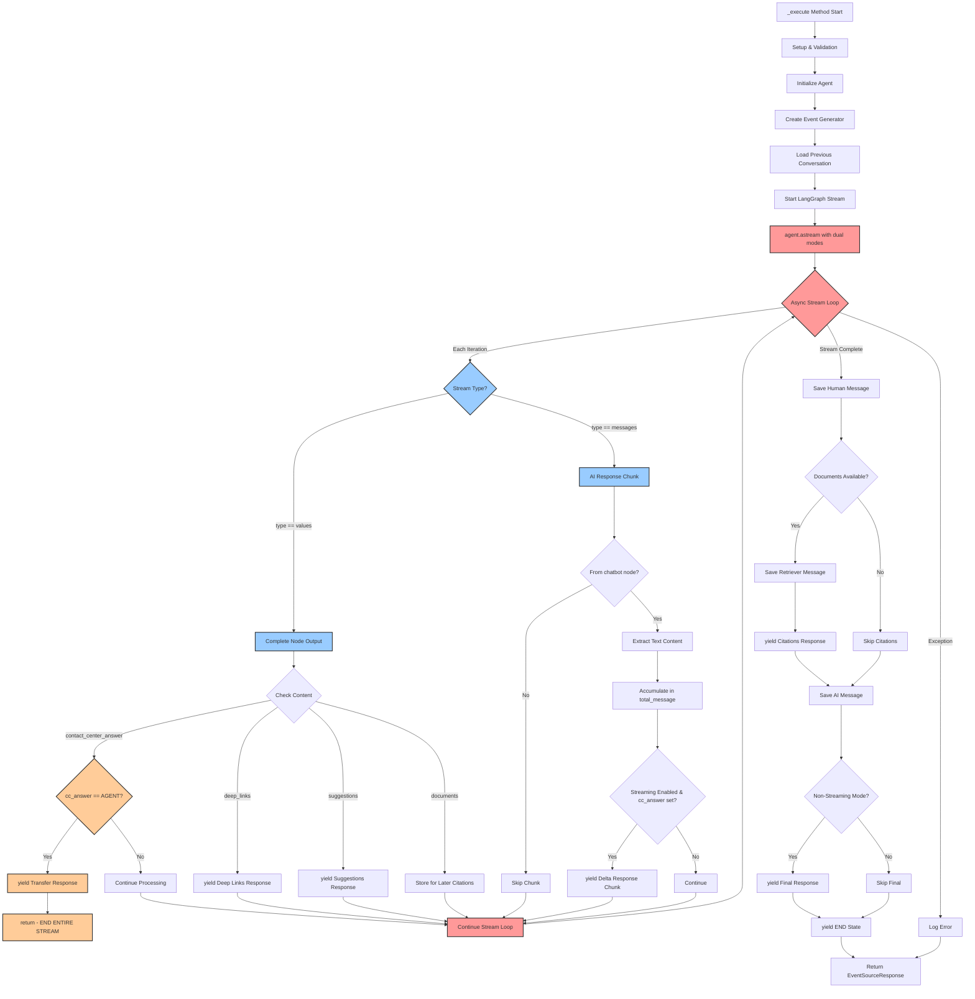
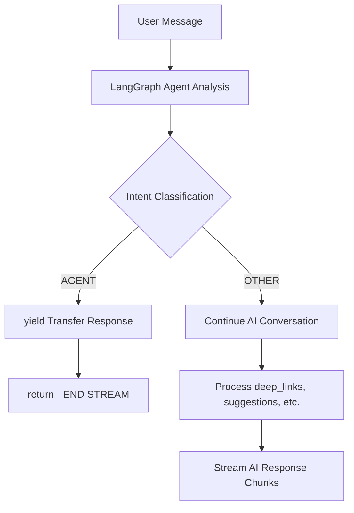

[← Back to Documentation Home](README.md)

# _execute Method Flow Analysis

## Overview

The `_execute` method in `conversation.py` is the core orchestrator that processes user messages through a complex LangGraph workflow. This document provides a detailed breakdown of the flow with code references and a visual diagram.

## Flow Diagram



### **Key Diagram Features**

**🔄 Dual Stream Processing**: Shows how both `"values"` and `"messages"` streams are processed simultaneously in the same async loop

**⚡ Early Termination**: Highlights the critical `cc_answer == "AGENT"` decision that can immediately end the entire stream

**🔁 Async Loop**: Represents the `async for type, value in agent.astream()` loop that orchestrates everything

**📦 Values Stream**: Complete node outputs that trigger business logic decisions

**💬 Messages Stream**: Real-time AI response chunks for streaming user experience

**🚨 Critical Paths**: Color-coded to show the most important decision points

## Code Reference Map

### **Phase 1: Method Setup** - *[Lines 346-372](../chatbot_api/services/conversation.py#L346-L372)*

```python
# conversation.py:346-372 - https://github.com/santander-group-ods/IA-mb-api-chatbot/blob/main/chatbot_api/services/conversation.py#L346-L372
async def _execute(
    self,
    session_context: SessionContext,
    request: SendSaveMessageRequest,
) -> EventSourceResponse:
    user_question = request.input.text
    is_streaming = request.input.options.stream
    suggestions = request.input.options.suggestions
    
    # Turn count management
    session_context.turn_count = (
        int(request.context.system.turnCount) + 1
        if request.context.system.turnCount
        else 0
    )
```

**Purpose**: Extract request parameters and initialize session state

---

### **Phase 2: Agent Initialization** - *[Lines 373-379](../chatbot_api/services/conversation.py#L373-L379)*

```python
# conversation.py:373-379 - https://github.com/santander-group-ods/IA-mb-api-chatbot/blob/main/chatbot_api/services/conversation.py#L373-L379
agent = Agent(self.agent_config, suggestions)
session_context.response_id = uuid.uuid4().hex
```

**Purpose**: Create LangGraph agent with configuration and generate unique response ID

---

### **Phase 3: Event Generator Setup** - *[Lines 381-409](../chatbot_api/services/conversation.py#L381-L409)*

```python
# conversation.py:381-409 - https://github.com/santander-group-ods/IA-mb-api-chatbot/blob/main/chatbot_api/services/conversation.py#L381-L409
async def event_generator():
    try:
        # Initialize response tracking variables
        total_message = ""
        cc_answer = None
        deep_links = None
        suggestions_answer = None
        final_state = None
        span_id = None
        initial_message_sent = False
        
        # Load conversation history
        previous_conversation_items = service_aws.get_conversation(
            conversation_id=session_context.conversation_id
        )
```

**Purpose**: Set up streaming response generator and load conversation context

---

### **Phase 4: Conversation History Processing** - *[Lines 389-406](../chatbot_api/services/conversation.py#L389-L406)*

```python
# conversation.py:389-406 - https://github.com/santander-group-ods/IA-mb-api-chatbot/blob/main/chatbot_api/services/conversation.py#L389-L406
previsous_conversation = []
for item in previous_conversation_items:
    if item.get("guardrailApplied", {}).get("BOOL", False):
        continue  # Skip guardrail-filtered messages
    if item.get("author", {}).get("S", "") in ["human", "retriever"]:
        message = HumanMessage(item.get("message", {}).get("S", ""))
    else:
        message = AIMessage(item.get("message", {}).get("S", ""))
    previsous_conversation.append(message)
```

**Purpose**: Convert DynamoDB conversation history to LangChain message format

---

### **Phase 5: LangGraph Stream Execution** - *[Lines 410-421](../chatbot_api/services/conversation.py#L410-L421)*

```python
# conversation.py:410-421 - https://github.com/santander-group-ods/IA-mb-api-chatbot/blob/main/chatbot_api/services/conversation.py#L410-L421
async for type, value in agent.astream(
    {
        "messages": [SystemMessage(PROMPT)]
        + previsous_conversation
        + [HumanMessage(user_question)],
        "user_question": user_question,
    },
    stream_mode=["messages", "values"],
):
```

**Purpose**: Start LangGraph execution with dual stream modes

#### **Stream Modes Explained**

- **`"messages"`**: Streams individual AI response chunks (for real-time chat)
- **`"values"`**: Streams complete node outputs (for intent classification, tools, etc.)

#### **Understanding Dual Flow Modes**

The `stream_mode=["messages", "values"]` creates **two parallel data streams** that enable sophisticated real-time processing:

**1. "values" Stream** 📦

**What it contains**: Complete outputs from LangGraph workflow nodes

**When it triggers**: When a node finishes processing

**Example data**:
```python
{
    "contact_center_answer": CCAnswer(answer="AGENT"),
    "deep_links": ["https://example.com/help"],
    "suggestions": SuggestionsAnswer(followup_questions=["What else?"]),
    "documents": [Document(...), Document(...)],
    "guardrail_applied": False
}
```

**2. "messages" Stream** 💬

**What it contains**: Real-time AI response chunks as they're generated

**When it triggers**: As the AI generates each piece of text

**Example data**:
```python
[AIMessage(content="Hello"), {"langgraph_node": "chatbot"}]
```

**How They Work Together**

Looking at the code flow:

```python
if type == "values":
    # Process complete node outputs
    if not cc_answer and "contact_center_answer" in value:
        cc_answer = value["contact_center_answer"].answer
        if cc_answer == "AGENT":
            # Transfer to human agent immediately
            yield json.dumps(...)
            return
```

vs.

```python
else:  # type == "messages"
    # Process real-time AI chunks
    metadata = value[1]
    chunk = value[0]
    if metadata.get("langgraph_node", "") != "chatbot":
        continue
    total_message += chunk
    if chunk and is_streaming:
        yield json.dumps(...)  # Stream chunk to user
```

**Why Dual Modes Matter**

**Business Logic Decisions** (values stream):
- **Contact Center Intent**: `cc_answer == "AGENT"` → Transfer to human
- **Deep Links**: Show navigation options  
- **Suggestions**: Display follow-up questions
- **Documents**: Handle RAG citations

**Real-time User Experience** (messages stream):
- **Immediate Feedback**: User sees response as it's generated
- **Streaming Chat**: Like ChatGPT's typing effect
- **Responsive UI**: No waiting for complete response

**The Key Insight**

The system can **simultaneously**:
1. **Make smart decisions** based on AI analysis (values)
2. **Stream responses** in real-time for user experience (messages)

This enables intelligent routing (like transferring to human agents) while maintaining real-time responsiveness.

**Without dual modes**, you'd have to choose: either wait for complete analysis OR stream without intelligent routing. With dual modes, you get both! 🎉

---

### **Phase 6A: Values Stream Processing** - *[Lines 422-482](../chatbot_api/services/conversation.py#L422-L482)*

```python
# conversation.py:422-482 - https://github.com/santander-group-ods/IA-mb-api-chatbot/blob/main/chatbot_api/services/conversation.py#L422-L482
if type == "values":
    # Contact Center Intent Check
    if not cc_answer and "contact_center_answer" in value:
        cc_answer = value["contact_center_answer"].answer
        if cc_answer == "AGENT":
            # Transfer to human agent
            yield json.dumps(
                SendMessageToAgentResponse.build_transfer_to_agent_response(
                    session_context=session_context
                ).model_dump(),
                ensure_ascii=False,
            )
            return  # End stream immediately
    
    # Deep Links Processing
    if not deep_links and "deep_links" in value and value["deep_links"]:
        deep_links = value["deep_links"]
        yield json.dumps(
            SendMessageToAgentResponse.build_deep_links_response(
                session_context=session_context,
                deeplinks=deep_links,
                state=state,
            ).model_dump(),
            ensure_ascii=False,
        )
    
    # Suggestions Processing
    if not suggestions_answer and "suggestions" in value:
        suggestions_answer = value["suggestions"]
        yield json.dumps(
            SendMessageToAgentResponse.build_suggestions_response(
                session_context=session_context,
                suggestions=suggestions_answer.followup_questions,
                state=state,
            ).model_dump(),
            ensure_ascii=False,
        )
```

**Purpose**: Process complete node outputs from LangGraph workflow

#### **Contact Center Intent Classification Deep Dive**

The contact center logic represents one of the most critical decision points in the entire conversation flow. Understanding this mechanism is essential for grasping how the system intelligently routes conversations.

**What is `cc_answer`?**

`cc_answer` is **NOT** the contact center's response. It's the **AI's decision** about whether the user needs to be transferred to a human agent.

**Step-by-Step Flow Analysis:**

**1. Initial State** - *[Line 386](../chatbot_api/services/conversation.py#L386)*
```python
cc_answer = None  # Initially empty - no decision made yet
```

**2. Values Stream Processing** - *[Line 423](../chatbot_api/services/conversation.py#L423)*
```python
if type == "values":  # ✅ YES - this IS a values stream
    if not cc_answer and "contact_center_answer" in value:
        cc_answer = value["contact_center_answer"].answer  # ← Critical decision point
```

**What this means:**
- **`type == "values"`** ✅ This is the values stream (complete node outputs)
- **`not cc_answer`** ✅ We don't have a value yet because it hasn't been generated
- **`"contact_center_answer" in value`** ✅ The LangGraph agent has completed its **intent classification** analysis

**3. The Critical Decision** - *[Lines 424-434](../chatbot_api/services/conversation.py#L424-L434)*
```python
cc_answer = value["contact_center_answer"].answer
if cc_answer == "AGENT":
    # Transfer to human agent
    yield json.dumps(
        SendMessageToAgentResponse.build_transfer_to_agent_response(
            session_context=session_context
        ).model_dump(),
        ensure_ascii=False,
    )
    return  # ← ENDS THE STREAM HERE!
```

**What Actually Happens:**

1. **LLM Analysis**: The agent analyzes the user's message using an **intent classification model**
2. **Decision Output**: The LLM decides:
   - **`"AGENT"`** = "This user needs human help" 
   - **`"OTHER"`** = "I can handle this conversation"
3. **Stream Response**: Based on the decision:
   - **If `"AGENT"`**: Send transfer response and **END STREAM immediately**
   - **If `"OTHER"`**: Continue with AI conversation

**Understanding `yield` and `return`:**

```python
if cc_answer == "AGENT":
    yield json.dumps(...)  # Send ONE final message: "Transferring to agent"
    return                 # EXIT the entire event_generator function
```

- **`yield`**: Sends the transfer response to the user
- **`return`**: **Immediately terminates** the entire stream processing
- **Result**: User sees "Transferring to human agent" and the conversation stops

**Real-World Examples:**

```python
# Example 1: Transfer to Human
# User: "I want to cancel my account immediately!"
# AI Analysis: "This is complex, needs human help"
# Result: cc_answer = "AGENT" → Stream ends with transfer message

# Example 2: Continue with AI  
# User: "What's my account balance?"
# AI Analysis: "I can handle this with knowledge base"
# Result: cc_answer = "OTHER" → Continue to AI response generation
```

**The Complete Decision Flow:**



**Key Insight:**

This is **early termination for intelligent routing**. The system can decide within milliseconds whether a conversation needs human intervention, preventing the AI from attempting to handle requests it shouldn't.

The `cc_answer` variable is essentially the **traffic controller** that determines the entire conversation flow. Without this logic, the AI might try to answer everything, leading to poor user experience for complex issues that truly need human help.

**Why This Matters:**

- **Intelligent Escalation**: Complex issues go directly to humans
- **Resource Optimization**: AI handles what it can, humans handle what they should
- **User Experience**: No frustrating loops of "AI trying to help but failing"
- **Early Decision**: Decision made before wasting resources on AI generation

---

### **Phase 6B: Messages Stream Processing** - *[Lines 483-511](../chatbot_api/services/conversation.py#L483-L511)*

```python
# conversation.py:483-511 - https://github.com/santander-group-ods/IA-mb-api-chatbot/blob/main/chatbot_api/services/conversation.py#L483-L511
# Extract message metadata and content
metadata = value[1]  # Message metadata
chunk = value[0]     # Message content

# Only process messages from 'chatbot' node
if metadata.get("langgraph_node", "") != "chatbot":
    continue

# Extract text content (handle both string and complex content)
if isinstance(chunk.content, str):
    chunk = chunk.content
else:
    chunk = "".join([
        (c.get("text", "") if c.get("type", "") == "text" else "")
        for c in chunk.content
    ])

total_message += chunk

# Stream chunks in real-time if streaming enabled
if self.agent_config.DisableContactCenter or cc_answer:
    if chunk and is_streaming:
        yield json.dumps(
            SendMessageToAgentResponse.build_send_conversation_response(
                chunk, session_context, DELTA_STATE
            ).model_dump(),
            ensure_ascii=False,
        )
```

**Purpose**: Process and stream AI response chunks in real-time

---

### **Phase 7: Final Message Persistence** - *[Lines 515-575](../chatbot_api/services/conversation.py#L515-L575)*

```python
# conversation.py:515-575 - https://github.com/santander-group-ods/IA-mb-api-chatbot/blob/main/chatbot_api/services/conversation.py#L515-L575
# Save human message to conversation history
service_aws.create_interaction(
    session_context=session_context,
    message=user_question,
    author="human",
    span_id=span_id,
    guardrail_applied=final_state.get("guardrail_applied", False),
)

# Process RAG documents if available
documents = final_state.get("documents", [])
if len(documents) > 0:
    citations = []
    document_content = ""
    for doc in documents:
        document_content += f"{doc.page_content}\n\n"
        citations.append((
            doc.metadata.get("source_metadata", {}).get("x-amz-bedrock-kb-source-uri", ""),
            doc.metadata.get("source_metadata", {}).get("x-amz-bedrock-kb-document-page-number", 0.0),
        ))
    
    # Save retriever message
    service_aws.create_interaction(
        session_context=session_context,
        message=service_aws.apply_mask_guardrail(GUARDRAIL_MASK_ID, GUARDRAIL_MASK_VERSION, document_content),
        author="retriever",
        span_id=span_id,
    )
    
    # Send citations response
    yield json.dumps(
        SendMessageToAgentResponse.build_citations_response(
            session_context=session_context, 
            citations=citations
        ).model_dump(),
        ensure_ascii=False,
    )

# Save AI response
service_aws.create_interaction(
    session_context=session_context,
    message=service_aws.apply_mask_guardrail(GUARDRAIL_MASK_ID, GUARDRAIL_MASK_VERSION, total_message),
    author="ai",
    span_id=span_id,
    guardrail_applied=final_state.get("guardrail_applied", False),
)
```

**Purpose**: Persist conversation messages and handle RAG citations

---

### **Phase 8: Response Finalization** - *[Lines 576-590](../chatbot_api/services/conversation.py#L576-L590)*

```python
# conversation.py:576-590 - https://github.com/santander-group-ods/IA-mb-api-chatbot/blob/main/chatbot_api/services/conversation.py#L576-L590
# Send final response for non-streaming mode
if not is_streaming:
    yield json.dumps(
        SendMessageToAgentResponse.build_send_conversation_response(
            total_message, session_context, DELTA_STATE
        ).model_dump(),
        ensure_ascii=False,
    )

# Send END state signal
yield json.dumps(
    SendMessageToAgentResponse.build_send_conversation_response(
        "", session_context, END_STATE
    ).model_dump(),
    ensure_ascii=False,
)
```

**Purpose**: Complete the response stream with final message and END signal

---

## LangGraph Workflow Nodes

The Agent class builds a workflow with these nodes (from *[agent.py:433-488](../chatbot_api/services/agent.py#L433-L488)*):

### **Core Nodes**:
- **`empty_initial`**: Entry point node
- **`chatbot`**: Main AI response generation  
- **`tools`**: Knowledge base retrieval
- **`empty_final`**: Exit point node

### **Optional Nodes** (based on configuration):
- **`check_cc_redirect`**: Contact center intent classification
- **`deep_link_invoke`**: Deep link generation
- **`suggestions`**: Follow-up question generation

### **Node Flow**:
```
START → empty_initial → [check_cc_redirect, deep_link_invoke, suggestions] → tools/chatbot → empty_final → END
```

## Key Concepts

### **Dual Stream Processing**
The method processes two types of streams simultaneously:
1. **Values Stream**: Complete node outputs (intents, tools, metadata)
2. **Messages Stream**: Incremental AI response chunks

### **State Management**
- **`INITIAL_STATE`**: First chunk of response
- **`DELTA_STATE`**: Incremental content chunks  
- **`END_STATE`**: Response completion signal

### **Error Handling**
- Comprehensive try-catch around the event generator
- Graceful degradation on parsing errors
- Detailed logging for debugging

### **Performance Optimizations**
- Streaming responses for real-time experience
- Early termination for agent transfers
- Lazy evaluation of optional features

## Related Documentation

- [LangGraph Implementation](langgraph-implementation.md) - Detailed agent workflow
- [Memory Management](memory-management.md) - Message persistence
- [Request & Response Models](request-response-models.md) - Data structures
